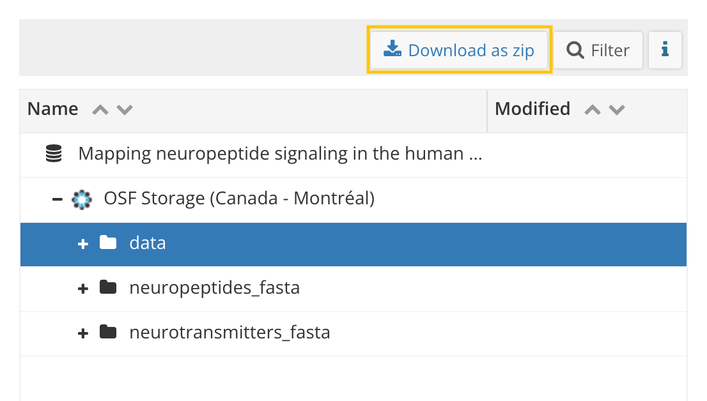

### How to download the data
Data to run all analyses is found on [OSF](https://osf.io/4rsz9/). To make sure the code runs correctly, download the data folder on OSF by selecting it and clicking on 'Download as zip' (see orange highlight below). Then, unzip the content in `data` into this folder.

If you're only interested in the neuropeptide receptor data, here's a quick link to download the [data table](https://osf.io/download/k38zu/).